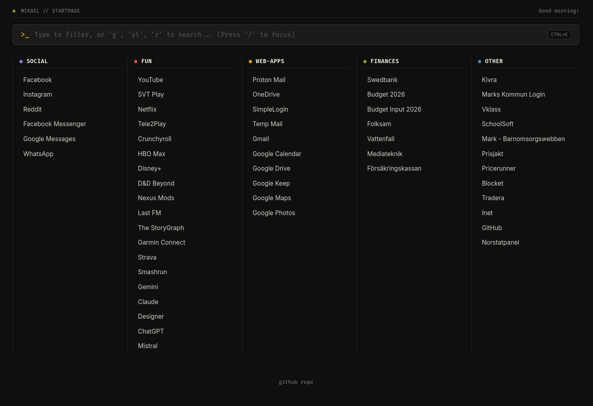

# Mikael's Custom Browser Startpage



A fast, minimalist, keyboard-first CLI browser startpage. Built with a Kanban layout, dynamic greetings, live link filtering, search engine shortcuts, and a dark **Flexoki** color palette.

> ⚡ **Vibe Coded with Gemini** — Collaboratively designed and refined through interactive prompts and live feedback.

---

## ✨ Features

* **⌨️ Command-Line First (CLI) Interface:**
  * **Auto-Focus:** Ready to type immediately when you open a new tab.
  * **Spotlight Filter:** Real-time search filtering across all bookmarks as you type.
  * **Keyboard Navigation:** Use `Arrow Up` / `Arrow Down` or `Tab` to cycle through filtered results and press `Enter` to open.
  * **Global Hotkey:** Press `/` or `Ctrl+K` (`Cmd+K`) from anywhere on the page to focus the search bar.
* **🔍 Search Engine Prefixes:**
  * `g <query>` → Instant Google search.
  * `yt <query>` → Instant YouTube search.
  * `r <subreddit>` → Jump directly to any subreddit (e.g., `r mechanicalkeyboards`).
  * *Fallback:* Pressing `Enter` on any query that doesn't match a bookmark defaults to a Google search.
* **📋 Minimalist Kanban Layout:**
  * Clean, 5-column desktop layout separated by subtle vertical lane dividers.
  * Category-specific accent glows on hover and keyboard selection.
  * Responsive mobile-friendly view.
* **🎨 Flexoki Dark Palette:** Warm, low-contrast dark theme designed for easy reading.
* **🕒 Dynamic Greeting:** Time-based greeting system (`Good morning!`, `Good afternoon!`, etc.).

---

## ⚙️ Configuration

All bookmarks and categories are managed in `config.js`:

```javascript
const cards = [
  {
    name: "Social",
    bookmarks: {
      "Facebook": "[https://facebook.com](https://facebook.com)",
      "Instagram": "[https://instagram.com](https://instagram.com)",
      "--- Sub Category ---": null, // Dividers
      "Reddit": "[https://reddit.com](https://reddit.com)"
    }
  },
  // ... configure up to 5 categories ...
];
```

* Adding Dividers: Use `--- Divider Name ---: null` inside `bookmarks` to create subtle section breaks within a category lane.
* Custom Categories: The `name` property automatically maps to the corresponding Kanban lane ID (`box-<category-name>`).

## 🛠️ Built With
* **Fonts:** Fira Code & Inter via Google Fonts.
* **Palette:** Flexoki Dark by Steph Ango.
* **Inspiration:** Minimalist CLI tools, Raycast, and GABEstart.

## 🤝 Credits & Acknowledgments
* Vibe Coded with Google Gemini 🤖
* Original base inspired by GABEstart by [GABEweb](https://github.com/gabeweb).
* Flexoki Theme Palette by [Steph Ango](https://stephango.com/flexoki).
